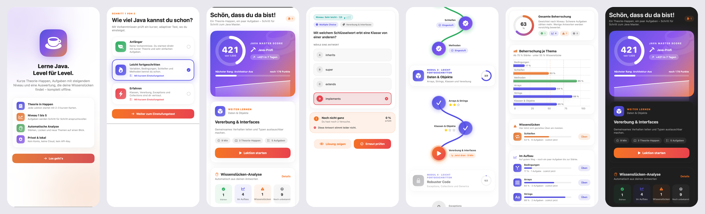
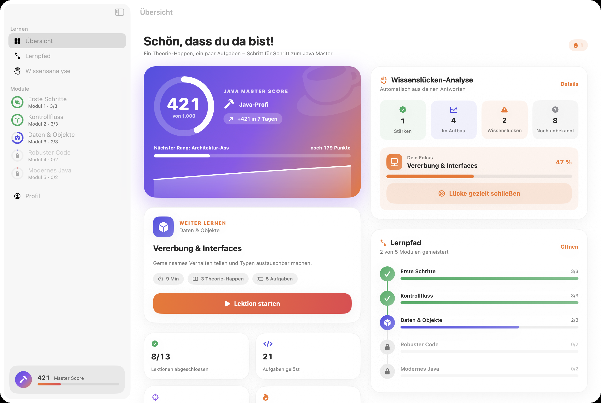
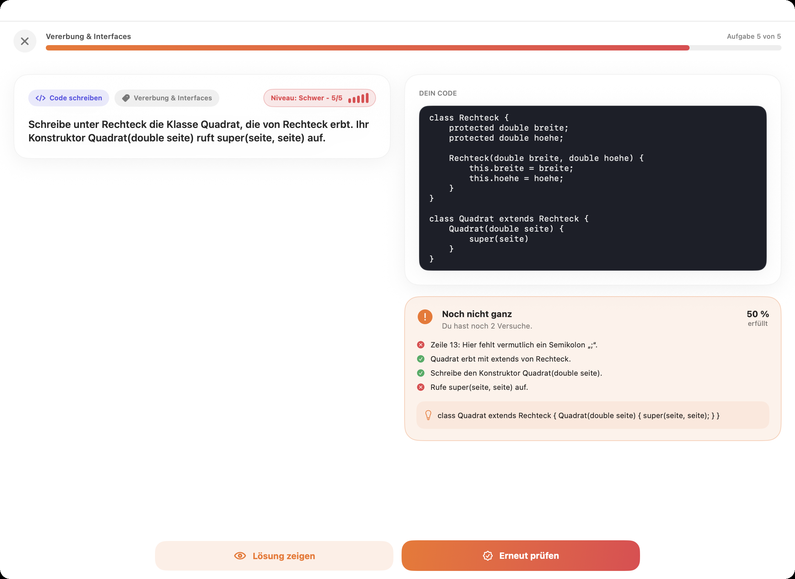
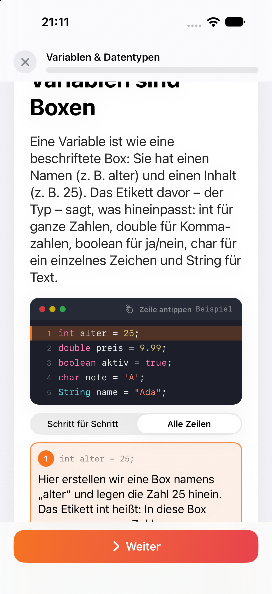
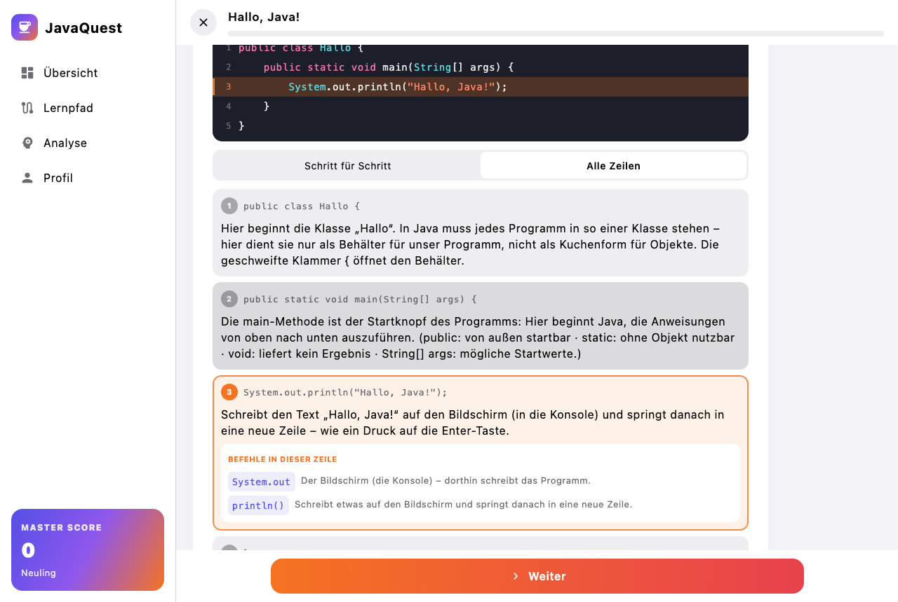
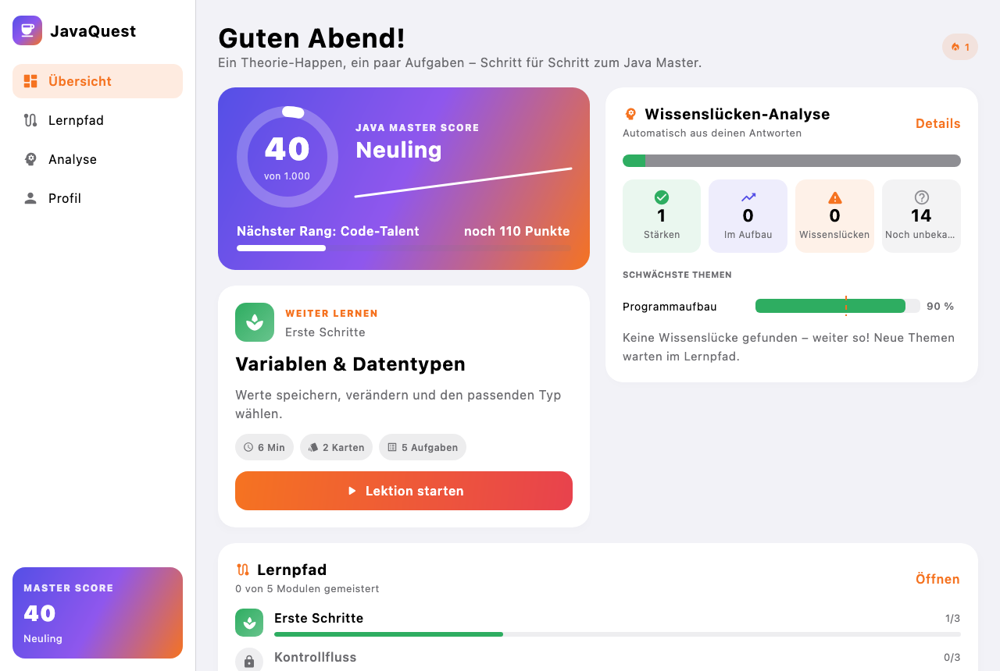
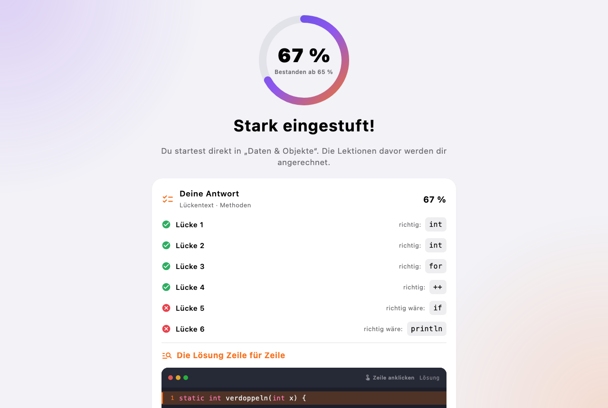

# JavaQuest – Java lernen, Level für Level

Java-Lern-App für **iPhone, iPad, Mac und Windows**. Sie läuft vollständig lokal: kein Server,
kein Konto, kein API-Key. Kurze Theorie-Happen, **jede Codezeile in Alltagssprache erklärt**,
Aufgaben mit Niveau 1–5, eine automatische Auswertung von Stärken und Wissenslücken und ein
Java Master Score von 0 bis 1000.

- **Apple:** iOS/iPadOS 17, macOS 14 · Swift 6 (strict concurrency) · SwiftUI · SwiftData · Swift Charts
- **Windows:** Windows 10/11 (64 Bit) · Kotlin 2.4 · Compose Multiplatform 1.12 (Desktop) – Ordner `Windows/`
- **Inhalt:** 13 Module, 32 Lektionen, 160 Lektionsaufgaben + 253 Übungsaufgaben im Pool (413 übbar),
  1 Einstufungsfrage mit 6 Lücken, 2608 erklärte Codezeilen, Befehlslexikon mit 212 Einträgen (Deutsch),
  UML-Klassendiagramme, Endlos-Training und freies Lernen – eine gemeinsame Kursdatei für alle Plattformen
- **Bestanden ab 69 %** (zentral in `LessonSession.passThreshold`)

**Windows sofort ausprobieren:** `dist/JavaQuest-Windows-1.0.0.zip` entpacken und
„JavaQuest starten.bat“ doppelklicken – ohne Installation, Java liegt bei (siehe [Windows](#windows)).









Die Screenshots zeigen echte App-Views mit echter Logik; die Beispieldaten stammen aus `PreviewSupport`.

## Auf ein iPhone bringen

Für das eigene Gerät reicht Xcode mit einer normalen Apple-ID (Installation hält 7 Tage).
Um die App an andere zu verschicken, führt der Weg über TestFlight und das Apple Developer
Program – Schritt für Schritt beschrieben in [Docs/TestFlight.md](Docs/TestFlight.md).

## Öffnen & starten

1. `JavaQuest.xcodeproj` in Xcode 16 oder neuer öffnen.
2. Unter *Signing & Capabilities* das eigene Team wählen und `PRODUCT_BUNDLE_IDENTIFIER`
   (`io.github.niklas122212.JavaQuest`) bei Bedarf auf die eigene ID ändern.
3. Schema **JavaQuest**, Ziel iPhone/iPad-Simulator oder „My Mac“ – ⌘R.

Tests des Kerns: Schema **JavaQuestKit** → ⌘U, oder im Terminal:

```bash
cd Packages/JavaQuestKit && swift test
```

Java-Inhalte gegen ein echtes JDK prüfen (JDK 21+ im PATH):

```bash
python3 Tools/verify_java_content.py
```

## Architektur

```
JavaQuest.xcodeproj
├── JavaQuest/                     App-Target (synchronisierter Ordner)
│   ├── App/                       Einstieg, AppModel (Start/Fehlerfall), AppRouter
│   ├── Persistence/               SwiftData-Modelle, Schema V1 + Migrationsplan, ProgressStore
│   ├── DesignSystem/              Theme, Karten, Buttons, DifficultyBadge, ProgressRing, CodeBlockView
│   ├── Features/
│   │   ├── Shell/                 iPhone: TabView · iPad/Mac: NavigationSplitView mit Sidebar
│   │   ├── Onboarding/            Zwei Start-Optionen → Einstufungsfrage → Ergebnis mit erklärter Lösung
│   │   ├── Dashboard/             Master Score, Weiterlernen, Wissenslücken, Lernpfad, Kennzahlen
│   │   ├── Path/                  Lernpfad als geschwungener Weg mit Stationen
│   │   ├── Analysis/              Stärken / Lücken / im Aufbau / unbekannt, Diagramm je Thema
│   │   ├── Lesson/                Lern-Loop: Theorie → Aufgaben → Auswertung
│   │   ├── Exegesis/              Code-Exegese: anklickbare Zeilen + Erklärungen + Befehlslexikon
│   │   └── Profile/               Profil, Datenschutz, Zurücksetzen (Mac: auch Einstellungen)
│   ├── Support/PreviewSupport     Beispieldaten für #Preview (über die echten Abläufe erzeugt)
│   └── Resources/                 Assets (AppIcon, AccentColor), PrivacyInfo.xcprivacy
├── Packages/JavaQuestKit/         Plattformunabhängiger Kern (SwiftPM, ohne UI)
│   ├── Content/                   Course/Lesson/LearningTask (Codable), Validator, Loader
│   ├── Evaluation/                AnswerEvaluator, JavaSource (Lexer), JavaHighlighter
│   ├── Progress/                  PlacementTest, LessonSession, MasterScore, LearningPath, KnowledgeAnalyzer,
│   │                              Training (Endlos + frei), VariantSelector (Aufgaben-Varianten)
│   ├── Content/UMLDiagram         UML-Klassendiagramme: Modell und plattformgleiches Layout
│   ├── Evaluation/CodeExplainer   Zeilen-Erklärungen in Alltagssprache (Regeln + Blockstapel)
│   └── Resources/java_course.json Der komplette Kurs (auch für Windows)
├── Windows/                       Windows-App (Kotlin, Compose Desktop): core/ · data/ · ui/ · tools/
├── Config/                        Info.plist-Ergänzung, macOS-Entitlements (Sandbox)
├── Tools/course/                  Quelle des Kurses (Python) → java_course.json, mit Zeilen-Erklärungen
├── Tools/verify_java_content.py   Prüft alle Code-Beispiele mit javac/java
└── Tools/check_course.py          Konsistenz: Themen erreichbar, keine Doppel, UML vollständig
```

**Warum ein eigenes Paket?** Alles, was Wissen über Java, Bewertung und Fortschritt enthält,
liegt in `JavaQuestKit` – reine Werttypen, keine UI, keine Persistenz. Dadurch ist der Kern mit
`swift test` in Sekunden testbar, und die App-Schicht bleibt dünn: Views lesen abgeleitete
Werte aus dem `ProgressStore`, der SwiftData-Modelle in Werttypen übersetzt und die reinen
Funktionen des Kerns aufruft.

```
 SwiftUI-Views ──liest──▶ ProgressStore (@Observable, @MainActor) ──▶ SwiftData (lokal)
       │                        │
       └──── LessonFlowModel ───┴──▶ JavaQuestKit: Evaluator · Einstufung · Score · Analyse
```

## App-Ablauf

1. **Start mit zwei Optionen:** „Ich habe 0 Erfahrung“ → Grundkurs. „Ich habe schon Vorkenntnisse“ →
   **eine** Einstufungsfrage (ein Programm mit 6 Lücken, Teilpunkte je Lücke). Ab **≥ 65 %** geht es
   direkt zu Modul 3 „Daten & Objekte“, der Grundkurs wird angerechnet; darunter startet der Grundkurs.
   Während der Frage gibt es keine Hilfen – danach wird jede Lücke und die Lösung Zeile für Zeile erklärt.
2. **Lern-Loop je Lektion:** 2–3 Theorie-Karten mit erklärtem Codebeispiel → 5 Aufgaben mit aufsteigendem
   Niveau 1→5 → Auswertung mit Trefferquote, Sternen, Score-Zuwachs und Ergebnis je Aufgabe.
   **Bestanden ab 90 %.**
3. **Code-Exegese** (überall, wo Code steht): oben der Code mit anklickbaren, nummerierten Zeilen, darunter
   die Erklärungen – umschaltbar zwischen „Schritt für Schritt“ (Vor/Zurück) und „Alle Zeilen“. Die gewählte
   Zeile ist in Code und Erklärung markiert; das Befehlslexikon erklärt jeden Befehl der Zeile.
   In Aufgaben öffnet sich die Erklärung auf Wunsch; Zeilen mit einer Lücke bleiben bis zum Lösen gesperrt.
   Nach dem Lösen zeigt die App die Musterlösung Zeile für Zeile.
4. **Wissensanalyse:** Stärken, Wissenslücken (mit „Gezielt üben“), Themen im Aufbau, noch unbekannte Themen –
   auf dem Dashboard als Verteilungsbalken und Balkengrafik der schwächsten Themen.
5. **Freies Lernen („Alle Themen“):** Jedes Thema ist jederzeit übbar – unabhängig vom Lernpfad. Man wählt
   Themen (auch mehrere), Niveau und Anzahl (5/10/15/25) und bekommt daraus eine eigene Übungsrunde. Jede Kachel
   zeigt den Stand des Themas: gesehen, richtig, Erfolgsquote.
6. **Aufgaben-Varianten statt Auswendiglernen:** Aufgaben zum selben Lernziel bilden eine Gruppe
   (`variantGroup`). Pro Sitzung kommt aus einer Gruppe nur eine Variante dran – zuerst eine ungesehene, nach
   einer falschen Antwort bewusst eine **andere**, sonst die am längsten nicht gezeigte. Das gilt auch beim
   Wiederholen einer Lektion.
7. **Endlos-Training:** Runden mit 8 gemischten Aufgaben aus allen abgeschlossenen Lektionen, Niveau aufsteigend,
   danach „Nächste Runde“. Welche Aufgaben drankommen, entscheidet ein Gewicht je Aufgabe: schwaches Thema
   bis +3, noch nie geübt +2, zuletzt falsch bis +3, lange nicht gesehen bis +2 (eine Woche = +1); heute schon
   fehlerfrei gelöst zählt nur ein Drittel. Training und Übungen verändern den Score nicht, nur die Wissensanalyse.

### Kursinhalt

| Modul | Stufe | Lektionen |
|---|---|---|
| 1 Erste Schritte | Anfänger | Hallo Java · Variablen & Datentypen · Rechnen & Operatoren |
| 2 Kontrollfluss | Anfänger | if & switch · Schleifen · Methoden |
| 3 Daten & Objekte | Fortgeschritten | Arrays & Strings · Klassen & Objekte · Vererbung & Interfaces |
| 4 Robuster Code | Fortgeschritten | Exceptions · Collections |
| 5 Modernes Java | Erfahren | Generics · Lambdas & Streams |
| 6 Objekte vertieft | Fortgeschritten | Enums & static · equals, hashCode & toString |
| 7 Daten & Dateien | Fortgeschritten | Texte, Eingabe & Dateien · Datum & Zeit |
| 8 Algorithmen | Erfahren | Rekursion · Suchen & Sortieren · Datenstrukturen |
| 9 Profi-Werkzeuge | Erfahren | Unit-Tests mit JUnit · Pakete, Build & Git |
| 10 Nebenläufigkeit | Erfahren | Threads & Synchronisation · Executor & virtuelle Threads |
| 11 Modernes Java vertieft | Erfahren | sealed & Pattern Matching · Streams für Profis |
| 12 Abschlussprojekte | Erfahren | Notenrechner · Aufgabenliste · Textabenteuer |
| 13 UML | Fortgeschritten | Der Klassenkasten · Beziehungen · UML ↔ Java |

## Didaktik: jede Zeile in Alltagssprache

Jede Codezeile im Kurs hat eine Erklärung ohne Fachchinesisch. Fachbegriffe werden über Bilder erklärt:

| Java | Bild |
|---|---|
| Variable, Typ | Box mit Etikett („In diese Box passen nur ganze Zahlen“) |
| Klasse / Objekt | Kuchenform / Kuchen (`new` = backen) |
| Methode, Parameter, `return` | Rezept, Zutaten, Automat, der sein Produkt ausgibt |
| Array / Liste / Map | Eierkarton / Einkaufszettel / Wörterbuch |
| Exception, `try`/`catch` | Alarm und Sicherheitsnetz |
| Stream, `filter`, `map` | Fließband, Sieb, Umformer |
| `Optional`, `record`, Kommentar, `switch` | Schachtel, Formular, Notizzettel, Weichensteller |

Beispiel: `int alter = 25;` → „Hier erstellen wir eine Box namens „alter“ und legen die Zahl 25 hinein.
Das Etikett int heißt: In diese Box passen nur ganze Zahlen.“

Die Erklärungen erzeugt `CodeExplainer` (Swift, regelbasiert, mit Blockstapel für schließende Klammern)
beim Erstellen des Kurses; sie stehen fertig im JSON und können von Hand überschrieben werden. Tests stellen
sicher, dass keine Zeile ohne Erklärung bleibt und jeder verwendete Befehl im Lexikon steht.

## Bewertungslogik

| Größe | Regel |
|---|---|
| **Aufgabe** | 1. Versuch richtig = 100 %, später richtig = 50 %, Lösung gezeigt = 0 %. Maximal 3 Versuche. |
| **Lektion** | Trefferquote = Σ(Niveau × Wertung) / Σ(Niveau). **Bestanden ab 90 %.** Sterne: ab 90 % ★, ab 95 % ★★, 100 % ★★★. Beispiel Lektion 1 (Niveaus 1,1,2,2,3): eine aufgedeckte leichte Aufgabe → 8/9 = 89 % → nicht bestanden. |
| **Einstufung** | Eine Frage mit 6 Lücken, Teilpunkte je Lücke: 4 von 6 = 67 % → bestanden, 3 von 6 = 50 % → Grundkurs. Bestanden ab 65 %. |
| **Java Master Score** | 0–1000. Jede **bestandene** Lektion zählt mit Gewicht × Bestwert. Gewicht = Summe der Aufgabenniveaus × Stufenfaktor (1,0 / 1,25 / 1,5). Es zählt nur der Bestwert – der Score kann nicht sinken. |
| **Ränge** | Neuling (0) · Code-Talent (150) · Java-Profi (350) · Architektur-Ass (600) · Java Master (850) |
| **Themenbeherrschung** | (Σ Niveau × Wertung + 1) / (Σ Niveau + 2), also Laplace-geglättet. **Stärke:** ≥ 75 % bei mind. 3 Aufgaben. **Lücke:** < 55 % bei mind. 2 Aufgaben. **Unbekannt:** noch keine Aufgabe. Sonst **im Aufbau**. |

## Datenmodell (SwiftData, `Persistence/ProgressModels.swift`)

| Modell | Inhalt |
|---|---|
| `LearnerProfile` | Selbsteinschätzung, Einstufung (Score, Stufe), Master Score, Serie; Beziehungen zu allen anderen Modellen (cascade) |
| `LessonRecord` | Bestwert, letzte Trefferquote, Anzahl Durchläufe, abgeschlossen / per Einstufung angerechnet |
| `TopicMastery` | gewichtete Treffer je Thema → Wissenslücken-Analyse |
| `TaskAttempt` | Protokoll jeder abgeschlossenen Aufgabe (Lektion, Übung, Training, Einstufung) – daraus liest das Endlos-Training, wie jede Aufgabe zuletzt lief |
| `ScoreSnapshot` | Verlauf des Master Scores (Sparkline) |

Alle Eigenschaften haben Standardwerte, alle Beziehungen sind optional. Damit ist das Schema
CloudKit-kompatibel, falls später iCloud-Sync dazukommt. Das Schema ist als `JavaQuestSchemaV1` mit
Migrationsplan versioniert, damit App-Updates bestehende Fortschritte migrieren können.

### Aufgabenpool und Varianten

Neben den Lektionsaufgaben steht im JSON ein `taskPool`: Übungsaufgaben, die nicht zum Lernpfad gehören.
Er speist gezielte Übung, Endlos-Training und freies Lernen und kann beliebig wachsen (die Oberfläche
kennt keine feste Aufgabenzahl). Jede Aufgabe darf eine `variantGroup` tragen:

```json
{ "id": "p-op-1b", "variantGroup": "t03-1", "topicId": "operators", "difficulty": 1, "type": "singleChoice" }
```

`VariantSelector` wählt daraus je Lernziel genau eine Aufgabe. Damit erscheint dieselbe Frage nicht zweimal
in einer Runde – und nach einer falschen Antwort beim nächsten Mal eine andere Variante desselben Lernziels.

### UML-Diagramme

Theorie-Karten und Aufgaben können ein `diagram` tragen. Beide Apps zeichnen es selbst (SwiftUI `Canvas`
bzw. Compose `Canvas`, keine Fremdbibliothek); `UMLLayout` berechnet die Anordnung auf beiden Plattformen gleich.

```json
"diagram": {
  "classes": [{ "name": "Hund", "kind": "classType", "methods": [{ "visibility": "+", "name": "laut()", "type": "String" }] }],
  "relations": [{ "from": "Hund", "to": "Tier", "kind": "extendsRelation", "multiplicity": "1..*" }]
}
```

Unter jedem Diagramm steht eine Legende, die jede Linie in Alltagssprache erklärt – inklusive Vielfachheiten.

## Kursformat (`java_course.json`)

```jsonc
{
  "schemaVersion": 1,
  "id": "java-core-de",
  "title": "Java – vom ersten Befehl zum Profi",
  "topics":  [{ "id": "loops", "title": "Schleifen", "symbol": "repeat", "summary": "…" }],
  "modules": [{
    "id": "m2-control-flow", "title": "Kontrollfluss", "subtitle": "…",
    "tier": "beginner",               // beginner | intermediate | advanced → Einstiegsmodul je Stufe
    "symbol": "arrow.triangle.branch",
    "lessons": [{
      "id": "l05-loops", "title": "Schleifen", "summary": "…",
      "topicIds": ["loops"], "estimatedMinutes": 7,
      "theory": [{ "title": "Die for-Schleife", "body": "…", "code": { "lines": [ … ] },
                   "callout": { "kind": "warning", "text": "…" } }],   // tip | warning | info
      "tasks": [ /* Aufgaben, Niveau aufsteigend */ ]
    }]
  }],
  "placement": {
    "passThreshold": 65, "questionsPerTest": 1, "startDifficulty": 3,
    "pools": { "intermediate": [ /* eine Lückentext-Aufgabe mit 6 Lücken */ ] }
  },
  "glossary": [{ "term": "int", "meaning": "Etikett für ganze Zahlen, z. B. 42." }]
}
```

**Code mit Zeilen-Erklärung.** Jedes Code-Feld (`code`, `template`, `starterCode`, `sampleSolution`) ist ein
Objekt mit Zeilen; ein einfacher String wird ebenfalls akzeptiert (dann erklärt die iOS-App zur Laufzeit):

```json
"code": { "lines": [
  { "code": "int alter = 25;",
    "explain": "Hier erstellen wir eine Box namens „alter“ und legen die Zahl 25 hinein. Das Etikett int heißt: In diese Box passen nur ganze Zahlen.",
    "terms": ["int", "="] },
  { "code": "System.out.println(alter);",
    "explain": "Schreibt den Inhalt der Box „alter“ auf den Bildschirm (in die Konsole) und springt danach in eine neue Zeile – wie ein Druck auf die Enter-Taste.",
    "terms": ["System.out", "println()"] },
  { "code": "" }
] }
```

`terms` verweist auf Einträge in `glossary`. Bei Lückentexten beschreibt `explain` den richtig ausgefüllten
Code; die Apps zeigen diese Erklärung erst nach dem Lösen. In SwiftData wird nur der Lernfortschritt
gespeichert – Code und Erklärungen kommen immer aus der Kursdatei, damit Korrekturen sofort überall wirken.

Gemeinsame Felder jeder Aufgabe: `id`, `type`, `topicId`, `difficulty` (1–5), `prompt`, optional
`code` und `hint`, `explanation`, optional `javaContext` (`statements` | `members` | `file`).

| `type` | Zusatzfelder | Auswertung |
|---|---|---|
| `singleChoice` | `choices`, `correctIndex` | Index-Vergleich |
| `fillBlank` | `template` mit `{{0}}`, `{{1}}` …; `blanks: [{ "accepted": [...], "caseSensitive": true }]` | ohne Leerzeichen verglichen, ein überzähliges `;` ist erlaubt, Teilpunkte je Lücke |
| `predictOutput` | `expectedOutput`, optional `alsoAccepted` | zeilenweise; Leerzeichen am Zeilenende und Leerzeilen am Rand werden ignoriert; Hinweis bei Groß-/Kleinschreibung |
| `code` | `starterCode`, `sampleSolution`, optional `expectedOutput`, `rules`, optional `structure` | siehe unten |

**Code-Aufgaben** werden ohne Compiler bewertet:

```json
"rules": [
  { "rule": "require", "pattern": "\\b(for|while)\\s*\\(", "message": "Nutze eine Schleife." },
  { "rule": "require", "pattern": "\"Winter\"", "message": "Gib „Winter“ aus.", "scope": "raw" },
  { "rule": "forbid",  "pattern": "5050", "message": "Nicht schummeln – lass Java rechnen." }
],
"structure": ["balancedDelimiters", "semicolons"]
```

- Die Regeln laufen auf dem Quelltext **ohne Kommentare**. Mit `scope: "code"` (Standard) werden
  zusätzlich die Inhalte von String-Literalen geleert. So erfüllt `"for ("` in einem String keine Schleifen-Regel.
- Die Struktur-Checks prüfen, ob Klammern ausgeglichen sind (mit Zeilennummer) und ob Semikolons
  fehlen. Die Semikolon-Heuristik ist bewusst vorsichtig: lieber einen Fehler übersehen, als korrekten Code abzulehnen.
- Der Score ergibt sich aus den erfüllten Regeln plus Struktur. Ein Treffer auf eine `forbid`-Regel halbiert ihn.
  **Richtig** heißt: alle `require` erfüllt, keine `forbid`, Struktur fehlerfrei.
- Typografische Anführungszeichen („Smart Quotes“) von der iOS-Tastatur werden vorher zu ASCII normalisiert.

Das optionale Feld `verify` (`main`, `output`, `compiles`) ist reine Autoren-Metadaten für
`Tools/verify_java_content.py`. Die App ignoriert es.

**Neue Inhalte:** Die Kursdatei wird erzeugt, nicht von Hand bearbeitet. Lektionen stehen in
`Tools/course/course_source.py` (Module 1–5) und `Tools/course/content_advanced.py` (Module 6–12).
`Tools/course/build_course.sh` baut daraus `java_course.json`: Ein kleines Swift-Programm schreibt mit dem
`CodeExplainer` zu jeder Codezeile die Erklärung und die Lexikon-Begriffe. Findet es für eine Zeile keine
passende Regel, bricht der Bau ab. Danach `swift test` und `python3 Tools/verify_java_content.py`
laufen lassen. Der `CourseValidator` meldet doppelte IDs, falsche Sortierung, ungültige RegEx und
Musterlösungen, die der Evaluator nicht akzeptiert. In Debug-Builds läuft er auch beim App-Start.

## Windows

Eigene App im Ordner `Windows/` (Kotlin + Compose Desktop), gleiche Inhalte, gleiche Regeln, gleiche Gestaltung:
Seitenleiste (Übersicht, Lernpfad, Analyse, Profil), Onboarding mit zwei Optionen, Code-Exegese, Aufgaben,
Auswertung, Endlos-Training, Dashboard mit Diagrammen. Der Lernstand liegt als JSON in `%APPDATA%\JavaQuest\progress.json`.
Tastatur: Strg + Enter = Prüfen/Weiter, Enter/Tab = nächste Lücke, Tab im Code-Editor = 4 Leerzeichen.

| Aufgabe | Befehl (im Ordner `Windows/`) |
|---|---|
| Tests (Logik + Klick-Durchläufe der Oberfläche) | `./gradlew test` |
| App starten (Entwicklung) | `./gradlew run` |
| Portables ZIP mit Java-Laufzeit bauen (auf macOS/Linux) | `tools/package_windows.sh` → `dist/JavaQuest-Windows-1.0.0.zip` |
| Installer MSI/EXE bauen (nur unter Windows) | `gradlew.bat packageMsi packageExe` oder GitHub-Workflow `Windows-Installer` |

`package_windows.sh` baut die App, entfernt ungenutzte Symbole (122 → 86 MB), zeichnet als Selbsttest jeden
Bildschirm aller 32 Lektionen, eine Trainingsrunde und eine freie UML-Runde aus der fertigen JAR und legt die geprüfte Java-Laufzeit (Eclipse Temurin 21,
SHA-256-geprüft) bei.

## Geprüft (Stand 19.09.2026)

| Prüfung | Ergebnis |
|---|---|
| `swift test` (JavaQuestKit) | 53 Tests in 7 Suites bestanden – u. a. keine Zeile ohne Erklärung, Lexikon vollständig, Bestehensgrenze 68/69/70 %, Varianten-Rotation, freie Themenwahl, UML-Layout, Endlos-Training (falsch Gelöstes kommt über 400 Runden mehr als 3× so oft wie heute Gelöstes) |
| `Tools/check_course.py` | Keine Befunde: 29 Themen alle mit Aufgaben erreichbar, keine inhaltsgleichen Aufgaben, 32 UML-Diagramme vollständig, Niveaus steigen in jeder Lektion an |
| `Tools/verify_java_content.py` mit OpenJDK 25 | 326/326 Java-Prüfungen (Lektionen, Übungspool und Theorie-Beispiele), davon 324 mit Ausgabevergleich |
| `xcodebuild` (Xcode 27) für iOS-Simulator, iOS-Gerät, macOS | BUILD SUCCEEDED, 0 Warnungen |
| iPhone-Simulator (iOS 27), von Hand durchgeklickt | Onboarding (beide Optionen), Einstufung 5/6 = 83 %, Theorie mit Code-Exegese, alle 4 Aufgabentypen, 78 % → „Fast geschafft“, 100 % → 3 Sterne und +40 Score, Dunkelmodus; Endlos-Training: Runde mit 8 Aufgaben (Niveau 1→5), Lösung aufdecken, Auswertung, „Nächste Runde“, Score bleibt unverändert |
| Windows-App: `./gradlew test` | 46 Tests bestanden (41 Logik/Speicherung, 5 Klick-Durchläufe der echten Oberfläche mit Screenshots) |
| Windows-Paket: Selbsttest der fertigen JAR | 409 Bildschirme gezeichnet, alle 32 Lektionen und 160 Aufgaben durchgespielt, dazu Endlos-Training und eine freie UML-Runde, Score 1000 |

Nicht geprüft: Start auf einem echten Windows-PC (hier steht nur ein Mac zur Verfügung – die Windows-Bibliothek
`skiko-windows-x64.dll` und die Windows-Laufzeit liegen im Paket, laufen aber erst dort) sowie Signierung und Upload.

## App-Store-Checkliste

- [x] App-Icon für iOS (1024 px, ohne Alphakanal) und macOS (alle Größen)
- [x] Privacy Manifest (`PrivacyInfo.xcprivacy`): kein Tracking, keine Datenerhebung
- [x] `ITSAppUsesNonExemptEncryption = NO` (keine Exportfrage beim Upload)
- [x] macOS: App Sandbox **ohne** Netzwerk-Berechtigung, Hardened Runtime, Kategorie „Education“
- [x] iPad: alle Ausrichtungen (Multitasking), Launch Screen generiert
- [ ] Team und Bundle-ID setzen
- [ ] Screenshots, Beschreibung, Support-URL und Datenschutzerklärung in App Store Connect
      (Datenschutz-Angabe: „Keine Daten erfasst“)
- [ ] Namensprüfung: „Java“ ist eine Marke von Oracle. Bei beschreibender Nutzung wie
      „für Java-Lernende“ unkritisch; den App-Namen vor der Einreichung trotzdem prüfen.
